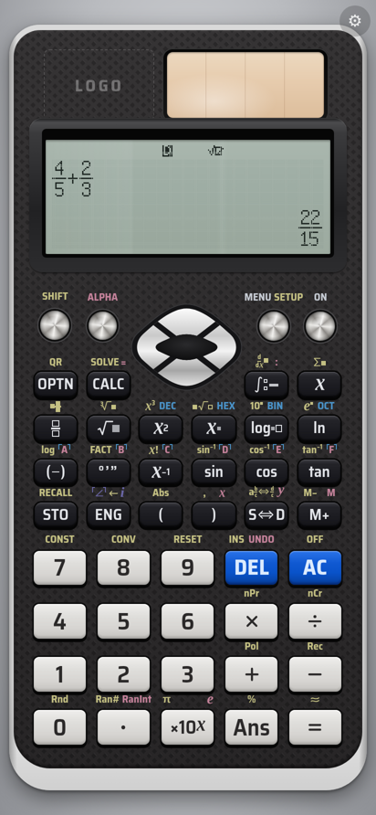

# SciCalc EX — fx-991EX style scientific calculator (PWA)

An installable, fully offline web app that reproduces the Casio fx-991EX
ClassWiz scientific calculator: same key layout and legends, a 192×63 dot-matrix
LCD, Math IO and Line IO, and all 12 calculation modes from the user manual.

- **Live app (after GitHub Pages is enabled, see below):** https://ithinkthatpizzasa-blip.github.io/fx991exemulator/
- Plain HTML + CSS + JavaScript ES modules. **No runtime dependencies, no CDN, no server code.**
- Calculation engine written from scratch (BigInt decimal arithmetic, 15 significant
  digits as in the manual's *Technical Information*), with exact fractions, √ forms and π forms.



> Casio, fx-991EX and ClassWiz are trademarks of Casio Computer Co., Ltd. This is an
> independent project; it uses no Casio logo, wordmark, artwork or manual text.

---

## Using it

**Install on Android (Chrome):** open the site → menu ⋮ → *Install app* (or the install banner).
It opens full-screen in its own window and works in airplane mode after the first launch.

**Install on Windows (Chrome / Edge):** open the site → click the install icon in the address bar.

**Desktop keyboard:** digits, `+ - * /`, `^` (power), `( )`, `.`, `,` (SHIFT `)`), `Enter`/`=` → `=`,
`Backspace`/`Delete` → DEL, `Esc` → AC, arrow keys → cursor pad, `F1` → SHIFT, `F2` → ALPHA,
`s c t` → sin cos tan, `l` → ln, `g` → log, `r` → √, `x` → 𝑥, `a` → Ans, `e` → ×10ˣ, `p` → π,
`!` → x!, `%` → %, `m` → MENU, `o` → OPTN, `d` → S⇔D, `Home` → ON.

**App settings** (⚙ in the top-right corner): key vibration (on by default where supported) and key
click sound (off by default).

Everything the calculator stores (setup, variables A–F/M/x/y, Ans, matrices, vectors, statistics
data, table functions, equation coefficients, the current screen and history) is saved in
`localStorage` after every key press, so closing the app or installing an update never loses work.
`SHIFT 9` (RESET) clears it exactly like on the real unit.

## Features (all from the user manual)

| Area | What is implemented |
|---|---|
| Input/Output | MathI/MathO, MathI/DecimalO, LineI/LineO, LineI/DecimalO; natural-display templates (fractions, mixed fractions, √, ∛, ˣ√, powers, 10ˣ, eˣ, log▫(▫), Abs, ∫, d/dx, Σ); INS, overwrite mode, UNDO; multi-line Line IO with Normal/Small font |
| Results | Norm 1/2, Fix 0–9, Sci 0–9, ENG and ←ENG, engineering symbols, S⇔D, a b/c⇔d/c, ≈, DMS, FACT (prime factorisation), digit separator, comma decimal mark, exact fraction/√/π forms with the manual's display limits |
| Calculate | all functions on the keyboard and OPTN (hyperbolic, angle units, engineering symbols), Ans, A–F/M/x/y variables, STO/RECALL, M+/M−, history ▲▼, replay ◀▶, multi-statements with Disp, CALC, SOLVE (Newton, *Continue:[=]*), CONST (47 CODATA 2010 constants), CONV (40 NIST SP 811 conversions) |
| Modes | Complex, Base-N (32-bit DEC/HEX/BIN/OCT + logic), Matrix (4×4, MatAns), Vector (2D/3D, VctAns), Statistics (8 types, Freq, quartiles, regression, estimates, normal distribution P/Q/R/▶t), Distribution (7 types, list and variable input), Spreadsheet (A1–E45, formulas, Grab, $, Fill Formula/Value, cut/copy/paste, Min/Max/Mean/Sum, auto calc), Table (f(x), g(x)), Equation/Func (2–4 unknowns, degree 2–4, complex roots), Inequality (degree 2–4), Ratio |
| Errors | Math, Stack, Syntax, Argument, Dimension, Variable, Can't Solve, Range, Time Out, Circular, Memory — with `[AC]:Cancel` and `[◀][▶]:Goto` |
| Power | ON, SHIFT AC (OFF), auto power-off after 10 minutes, contrast setting |

See [docs/TEST-REPORT.md](docs/TEST-REPORT.md) for the test results and the list of known deviations.

## Project layout

```
index.html, manifest.json, sw.js   the app shell, PWA manifest and service worker
css/calc.css                       calculator body (all geometry in photo-derived units)
fonts/                             bundled key-legend font (Saira Semi Condensed, OFL)
icons/                             app icons (placeholders - replace with the owner's artwork)
js/main.js                         bootstrap: UI, input, persistence, auto-update
js/calc.js                         calculator core: power, SHIFT/ALPHA, SETUP, RESET, CONST/CONV, RECALL
js/keymap.js                       key -> action table (incl. SHIFT/ALPHA/Base-N/Complex legends)
js/ui/                             keyboard + legends, LCD canvas, bitmap fonts, menus, MENU icons
js/editor/                         expression model (Math IO + Line IO), tokens, 2D layout renderer
js/engine/                         decimal, exact reals, complex, parser, evaluator, formatting,
                                   functions, matrices, statistics, polynomials, constants
js/modes/                          one module per MENU mode (+ shared calculation screen)
tests/                             node:test suite (dev only)
tools/                             dev-only scripts (server, screenshots, PWA check, font builder)
reference/                         put the manual/photo here locally (git-ignored, never shipped)
```

## Development

Requirements: **Node.js 20+** for the tests (no `npm install` needed — there are no dependencies).
Playwright + Chromium are only needed for the optional screenshot / PWA checks.

```sh
node tools/serve.mjs 8080          # serve locally -> http://localhost:8080/
node --test tests/*.test.js        # run the test suite  (or: npm test)
node tools/pwa-check.mjs           # Chromium: installability, precache, offline, auto-update
node tools/screenshot.mjs out.png 412 892 k1 add k2 eq   # screenshot after some key presses
node tools/lcdshot.mjs out.png '{}' 'MENU' 'SHIFT MENU'  # render LCD screens headless
node tools/build-font.mjs          # rebuild js/ui/fontdata.js (LCD fonts)
```

### Releasing a new version (cache name bump)

```sh
node tools/bump-version.mjs 1.0.1   # updates js/version.js, sw.js (cache "calc-v1.0.1") and manifest.json,
                                    # and refreshes the precache file list in sw.js
git commit -am "Release 1.0.1" && git push
```

If you add or remove app files, run `node tools/build-sw.mjs` (bump-version does it for you) so the
service worker precaches them.

**How updates reach installed apps:** on every launch and every time the app returns to the
foreground it calls `registration.update()`. A new service worker installs, calls `skipWaiting()`
and `clients.claim()`, and deletes old caches. The page is never reloaded while in use: the new
version is applied the next time the app is opened, or silently while it sits in the background.
The running version is shown in the ⚙ panel and printed in the console.

### Deploying to GitHub Pages (free)

1. On GitHub open the repository → **Settings → Pages**.
2. Under **Build and deployment → Source**, choose **GitHub Actions**.
3. Push to the default branch (or re-run the *Test and deploy* workflow from the **Actions** tab —
   until step 2 is done its *deploy* job fails with "Get Pages site failed", while the *test* job passes).
   The workflow runs the test suite and publishes only the app files (`index.html`, `manifest.json`,
   `sw.js`, `css/`, `js/`, `fonts/`, `icons/`).

The site is served from `https://<user>.github.io/<repo>/`; all paths in the app are relative, so it
works from that sub-path. Netlify or Cloudflare Pages also work: publish the same files with no build step.

## Owner to-do

- **App name:** currently the placeholder *SciCalc EX* — change it in `manifest.json` (`name`,
  `short_name`) and `index.html` (`<title>`).
- **Logo:** put the artwork in `icons/` and set `LOGO_SRC` in `js/brand.js`
  (e.g. `export const LOGO_SRC = './icons/logo.svg';`). It appears in the marked "LOGO" slot.
- **Icons:** replace `icons/icon-192.png`, `icons/icon-512.png` and `icons/icon-maskable-512.png`
  (maskable: keep the important part inside the central 80 %). Then bump the version.

## Credits and licences

- Key legend font: **Saira Semi Condensed** © The Saira Project Authors, SIL Open Font License 1.1 (`fonts/OFL.txt`).
- Large LCD font: glyphs derived from **GNU Unifont** (SIL OFL 1.1 / GPLv2+ with font embedding exception).
- Italic 𝑥 𝑦 𝑒 𝑖 key glyph outlines from **Liberation Serif Bold Italic** (SIL OFL 1.1).
- Small LCD font, icons, MENU pictograms and all code: written for this project.
